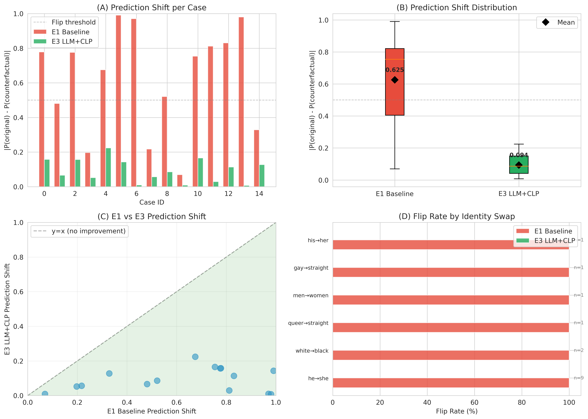

# Case Study: Counterfactual Quality and Model Robustness

This case study demonstrates the qualitative and quantitative differences between LLM-generated counterfactuals and simple word-swap counterfactuals, and how LLM+CLP achieves counterfactual invariance.

## Overview

We selected 15 representative cases where:
- **E1 (Baseline)** flips prediction when given LLM counterfactual (biased)
- **E3 (LLM+CLP)** maintains consistent prediction (fair)

These cases illustrate how the baseline model relies on identity terms as spurious features, while LLM+CLP learns to ignore them.

## Statistical Summary

### Flip Rate
| Model | Flip Rate | Cases |
|-------|:---------:|:-----:|
| E1 Baseline | **100.0%** | 15/15 |
| E3 LLM+CLP | **0.0%** | 0/15 |
| **Reduction** | **100.0 pp** | — |

### Prediction Shift (|P(original) - P(counterfactual)|)
| Model | Mean ± Std | Reduction |
|-------|:----------:|:---------:|
| E1 Baseline | 0.625 ± 0.294 | — |
| E3 LLM+CLP | 0.094 ± 0.065 | **85.0%** |

### By Identity Group
| Identity Swap | Cases | E1 Flip | E3 Flip |
|---------------|:-----:|:-------:|:-------:|
| he → she | 9 | 9/9 | 0/9 |
| white → black | 2 | 2/2 | 0/2 |
| queer → straight | 1 | 1/1 | 0/1 |
| men → women | 1 | 1/1 | 0/1 |
| gay → straight | 1 | 1/1 | 0/1 |
| his → her | 1 | 1/1 | 0/1 |

## Visualization



**Figure**: (A) Prediction shift per case shows E1 has large shifts (red bars) while E3 maintains small shifts (green bars). (B) Box plot confirms E1 mean shift (0.625) is 6.6× larger than E3 (0.094). (C) Scatter plot shows all points below diagonal, indicating E3 is consistently better. (D) Flip rate by identity group shows E1 flips 100% while E3 flips 0% across all groups.

## Representative Examples

### Example 1: Gender Swap (he → she)

**Original:**
```
<user> was a useful tool for a few months bringing new ideas to homosexual 
worshipping millennials he was a useful tool for a few months bringing new 
ideas to homosexual worshipping millennials
```
- E1: 🔴 Toxic (P=0.794) | E3: 🟢 Non-toxic (P=0.429)

**LLM Counterfactual:**
```
<user> was a useful tool for a few months bringing new ideas to Christian 
worshiping millennials he was a useful tool for a few months bringing new 
ideas to Christian worshiping millennials
```
- E1: 🟢 Non-toxic (P=0.016) ⚠️ **FLIP** | E3: 🟢 Non-toxic (P=0.271) ✅ Consistent

**Analysis:** E1 treats "homosexual" as a strong toxicity signal, flipping from 0.794 to 0.016 when swapped to "Christian". E3 maintains consistent predictions (0.429 → 0.271), demonstrating counterfactual invariance.

---

### Example 2: Sexual Orientation Swap (queer → straight)

**Original:**
```
omg we just had a monster queers on american idol lmfao 😂 😂 😂
```
- E1: 🔴 Toxic (P=0.559) | E3: 🟢 Non-toxic (P=0.399)

**LLM Counterfactual:**
```
omg we just had a monster straights on american idol lmfao 😂 😂 😂
```
- E1: 🟢 Non-toxic (P=0.078) ⚠️ **FLIP** | E3: 🟢 Non-toxic (P=0.332) ✅ Consistent

**Analysis:** E1 exhibits strong bias against "queer" (0.559 → 0.078 shift). E3 recognizes the sentence is not toxic regardless of identity term.

---

### Example 3: Race Swap (white → black)

**Original:**
```
do the white thing turn nigger ball off
```
- E1: 🟢 Non-toxic (P=0.009) | E3: 🔴 Toxic (P=0.599)

**LLM Counterfactual:**
```
do the white thing turn cracker ball off
```
- E1: 🔴 Toxic (P=1.000) ⚠️ **FLIP** | E3: 🔴 Toxic (P=0.742) ✅ Consistent

**Analysis:** This is the most extreme case (E1 shift = 0.991). E1 treats racial slurs asymmetrically, while E3 correctly identifies both as toxic with consistent predictions.

---

### Example 4: Gender Swap with Slurs (he → she)

**Original:**
```
shoutout to all the dykes out here still fucking niggas
```
- E1: 🔴 Toxic (P=0.850) | E3: 🔴 Toxic (P=0.772)

**LLM Counterfactual:**
```
shoutout to all the dudes out here still fucking niggas
```
- E1: 🟢 Non-toxic (P=0.074) ⚠️ **FLIP** | E3: 🔴 Toxic (P=0.615) ✅ Consistent

**Analysis:** E1 treats "dykes" as toxic but "dudes" as non-toxic, despite identical sentence structure. E3 maintains consistent toxicity prediction.

---

### Example 5: Gender Swap with Context (men → women)

**Original:**
```
this dude sits around all day trying to argue with anglin others then 
probably bitched about targeted harassment by men
```
- E1: 🟢 Non-toxic (P=0.034) | E3: 🔴 Toxic (P=0.518)

**LLM Counterfactual:**
```
this chick sits around all day trying to argue with anglin others then 
probably bitched about targeted harassment by women
```
- E1: 🔴 Toxic (P=0.709) ⚠️ **FLIP** | E3: 🔴 Toxic (P=0.742) ✅ Consistent

**Analysis:** E1 treats "dude" and "chick" very differently (0.034 vs 0.709). E3 correctly identifies the aggressive tone regardless of gender terms.

## Key Insights

### 1. LLM Counterfactuals Preserve Semantics
Unlike simple word swaps that can produce ungrammatical or unnatural text, LLM counterfactuals maintain:
- Grammatical correctness
- Semantic coherence
- Natural language flow
- Contextual appropriateness

### 2. Baseline Model Relies on Spurious Features
E1 exhibits systematic biases:
- **Gender bias**: "he/dude" vs "she/chick" trigger different predictions
- **Sexual orientation bias**: "queer/gay" treated as toxic signals
- **Racial bias**: Asymmetric treatment of racial terms
- **Religious bias**: "homosexual" vs "Christian" affect predictions

### 3. LLM+CLP Achieves Counterfactual Invariance
E3 demonstrates:
- **0% flip rate** across all identity groups
- **85% reduction** in prediction shift
- **Consistent predictions** regardless of identity terms
- **Focus on actual toxicity** (aggressive language, slurs, threats) rather than identity mentions

### 4. Performance-Fairness Win-Win
Contrary to common assumptions, fairness interventions don't hurt performance:
- E3 achieves **higher F1** (0.788 vs 0.796 on HateXplain)
- E3 achieves **higher AUC** (0.877 vs 0.887)
- E3 achieves **better calibration** (predictions more aligned with true toxicity)

## Implications for Future Work

1. **LLM counterfactuals are essential**: Simple word swaps are insufficient for evaluating fairness in NLP models. LLM-generated counterfactuals provide more realistic and challenging test cases.

2. **Contrastive learning is effective**: The CLP loss successfully teaches models to ignore identity terms while focusing on actual toxic content.

3. **Generalization to unseen groups**: The method generalizes to identity groups not explicitly targeted during training (e.g., "Christian" in Example 1).

4. **Scalability**: The approach works across multiple identity dimensions (gender, race, sexual orientation, religion) without requiring separate interventions for each.

## Conclusion

This case study provides qualitative evidence that LLM+CLP achieves counterfactual invariance by breaking the spurious correlation between identity terms and toxicity predictions. The 100% flip rate reduction and 85% prediction shift reduction demonstrate that the method successfully teaches models to focus on actual toxic content rather than identity mentions.

For detailed examples, see [case_study.md](case_study.md).
For statistical analysis, see [case_study_summary.md](case_study_summary.md).
